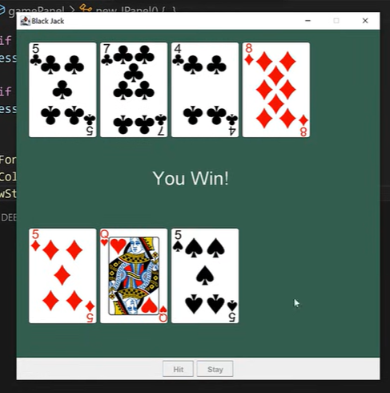
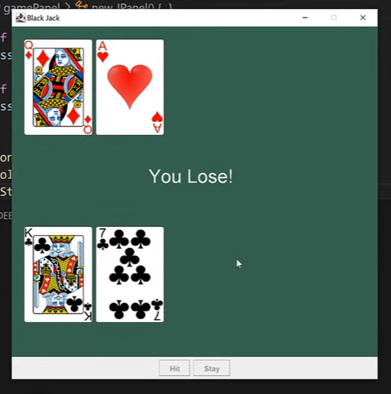
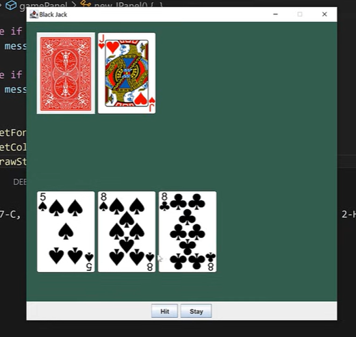

# BlackJack Game (Java Swing)

A simple yet fully functional **BlackJack** card game built using **Java Swing** with a graphical user interface. Players can hit or stay, and the dealer follows standard rules (hits until 17 or higher). The game supports Ace value adjustment (11 or 1) and displays win/loss/tie results.

---

## Features

- Full 52-card deck with suits: **Clubs (C), Diamonds (D), Hearts (H), Spades (S)**
- Card images for visual gameplay
- Dealer shows one card initially, hides the second
- "Hit" and "Stay" buttons
- Automatic Ace value reduction (`11 → 1`) when busting
- Win/Lose/Tie detection
- Clean UI with green felt background
- Card animations via `paintComponent`

---

## Screenshots

| You Win! | You Lose! | Dealer Hidden Card |
|--------|--------|--------|
|  |  |  |

---

## Project Structure

```
BlackJack/
│
├── src/
│   ├── BlackJack.java      # Main game logic and GUI
│   └── App.java            # Entry point (main method)
│
├── assets/
│   └── cards/              # Card images (PNG)
│       ├── A-C.png
│       ├── 2-D.png
│       └── ... (52 cards + BACK.png)
│
└── README.md
```

> **Note**: Card images must be placed in `assets/cards/` with naming format: `VALUE-SUIT.png` (e.g., `A-H.png`, `10-S.png`, `K-C.png`) and `BACK.png` for the card back.

---

## How to Run

### Option 1: Using an IDE (IntelliJ, Eclipse, VS Code)

1. Open the project folder.
2. Ensure `assets/cards/` contains all 52 card images + `BACK.png`.
3. Run `App.java`.

### Option 2: Compile & Run via Terminal

```bash
# Compile
javac -d bin src/*.java

# Run
java -cp bin App
```

> Make sure the `assets` folder is in the same directory as `bin` when running.

---

## Game Rules

- **Goal**: Get as close to 21 without going over.
- **Card Values**:
  - `2–10`: Face value
  - `J, Q, K`: 10
  - `A`: 11 or 1 (automatically adjusted)
- **Dealer**: Hits on 16 or lower, stays on 17+
- **Player Actions**:
  - **Hit**: Take another card
  - **Stay**: End turn, dealer plays

---

## Dependencies

- **Java Swing** (built-in)
- **Java AWT**
- Card images in `assets/cards/`

No external libraries required.

---

## Code Highlights

- Custom `Card` class with `getValue()`, `isAce()`, and image path
- Real-time UI updates using `repaint()`
- Proper Ace handling with `reducePlayerAce()` and `reduceDealerAce()`
- Resource loading via `getClass().getResource()`

---

## Future Improvements

- [ ] Add "Play Again" button
- [ ] Display current hand totals
- [ ] Add sound effects
- [ ] Support splitting and doubling down
- [ ] Score tracking
- [ ] Animations for dealing cards

---

## Author

**Your Name**  
*Java Developer | Game Enthusiast*

---

## License

This project is open-source and free to use for educational purposes.

---

### Instructions to Use This README

1. Save this content as `README.md` in your project root.
2. Create a `screenshots/` folder and add your three images:
   - `win.png`
   - `lose.png`
   - `hidden.png`
3. Create `assets/cards/` and place all card PNGs there.
4. Done! Your project is now professionally documented.

Let me know if you want a **GitHub-ready** version with badges, GIF demo, or downloadable ZIP setup!
```